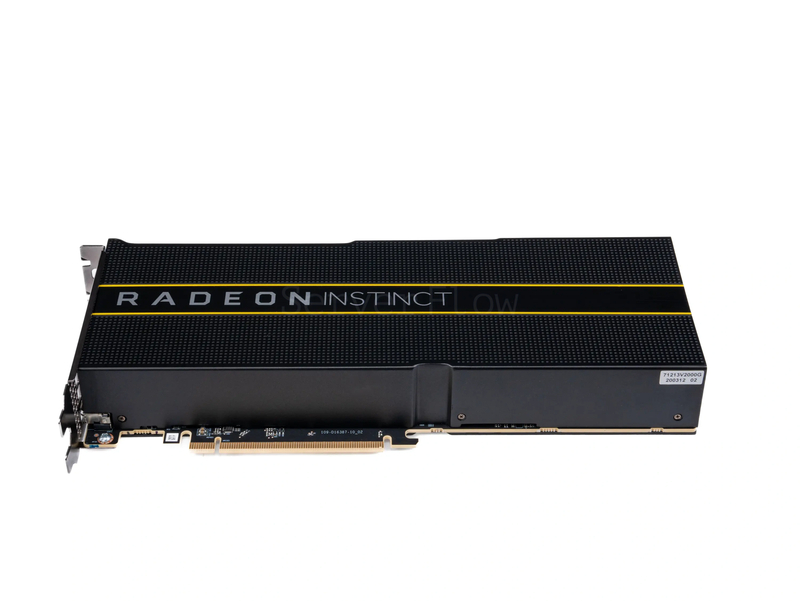
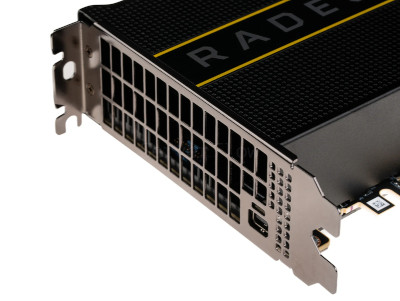
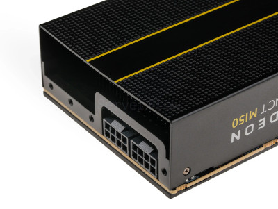
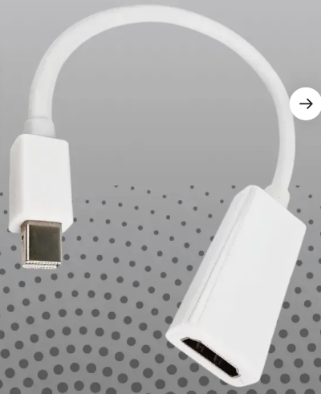

# AMD Radeon VII Instinct MI50 на домашнем ПК

## Введение

Есть серверная видеокарта AMD Radeon Instinct MI50 16GB, которая использовалась раньше в серверах для LLM, майнинга и других вычислительных задач. Сейчас она доступна для покупки и установки в домашний ПК, есть несколько статей и роликов об этом, но нет нигде полной информации как ее перевести с серверного варианта в домашний.

## Технические характеристики и особенности



https://www.techpowerup.com/gpu-specs/radeon-instinct-mi50.c3335

- На видеокарте может быть miniDP (miniDisplayPort), но зачастую в прошивке видеокарты он отключен.

- Карта требовательна по питанию (300W), но и требовательна по разъемам - надо 2 (два) 8-пиновых разъемов питания.

- Карта имеет пассивное охлаждение и подразумевает что оно будет производится внешним вентилятором. Для начала можно ее использовать без вентилятора, но не рекомендую это делать с нагрузкой.
- Видеокарта длинная, но может вполне войти в SFF-корпус (но лучше заранее проверить), мне пришлось выломать мешающие стойки в корпусе. Но если подключать вентилятор, то габариты резко увеличиваются в высоту или длину. Я покупал карту с вентилятором, который выступал сильно в сторону, поэтому я его убрал и заменил на другой.

## Установка в ПК (неправильная)
Если просто поставить карту в ПК, то ничего не будет:
- операционная система сможет ее увидеть, но не использовать
- драйвера не смогут подхватить видеокарту
- изображение не будет выдаваться на экран
- материнская плата может ругаться на отсутствие видеокарты вообще (звуковой сигнал 1 длинный - 2 коротких)

## Установка в ПК (правильная)

### Hardware
- Основная видеокарта для первоначальной настройки операционной системы и BIOS
- Переходник miniDP - HDMI



https://www.wildberries.ru/catalog/395602133/detail.aspx?targetUrl=SN

### BIOS
1) Должен быть включен режим загрузки только UEFI. Legacy + UEFI недопустим. CSM недопустимо. Все это надо выключить и оставить только UEFI
2) Secure boot отключить
3) Above 4g включить
4) Resize Bar включить

### Процедура

Процедуру можно выполнить и на Windows, и на Linux. Но на Windows придется помучиться с удаленным доступом.

1) Загрузить Linux (Рекомендуется Ubuntu 22.04)
2) Установить драйвера для работы с AMD: `amdgpu-install`

https://www.amd.com/en/support/downloads/previous-drivers.html/accelerators/instinct/instinct-mi-series/instinct-mi50.html

3) Скачать amdvbflash
https://github.com/stylesuxx/amdvbflash
https://www.techpowerup.com/download/ati-atiflash/

4) Скачать VBIOS подходящий, например:
https://www.techpowerup.com/vgabios/282270/282270.rom

5) Тут два варианта:
- Есть простая видеокарта с GOP и есть куда поставить MI50. Настроить BIOS, если он настроен был ранее, и сразу переходить к п. 6
- Нет возможности одновременно ставить 2 карты (у меня вторая карта была старая и BIOS принудительно уходил в LEGACY режим). Настроить BIOS, но сохранив настройки выключить компьютер, убрать простую карту и поставить MI50, включить компьютер и дождаться когда загрузится Linux. Зайти удаленно в консоль.

6) Использовать amdvbflash:
- проверить что видеокарта видна:
```bash
amdvbflash -i
```
- сохранить текущий VBIOS:
```
amdvbflash -s 0 current.vbios
```
- записать новый, например, 282270.rom:
```
amdvbflash -p 0 282270.rom
```

Примечание: скорей всего не получится и сругается защита, чтобы ее отключить надо добавить параметр `-f`

7) Перезапустить компьютер и получить работающий miniDP
